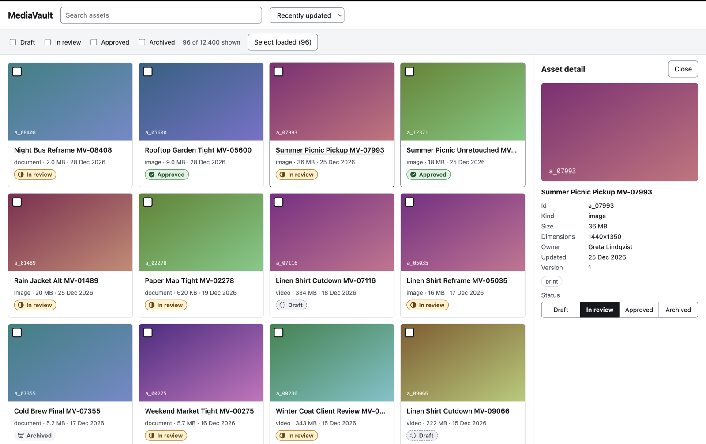
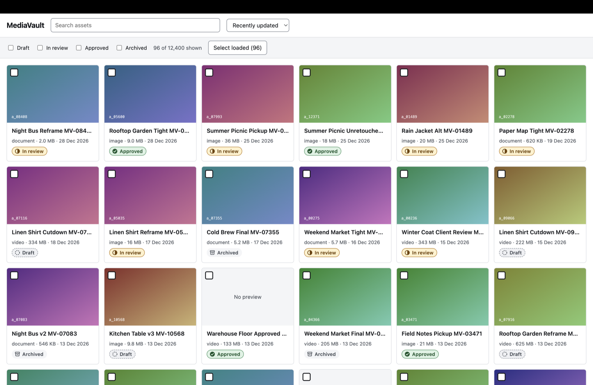
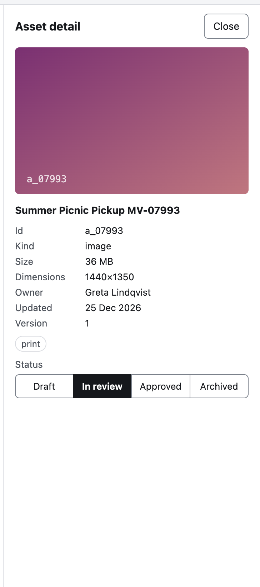
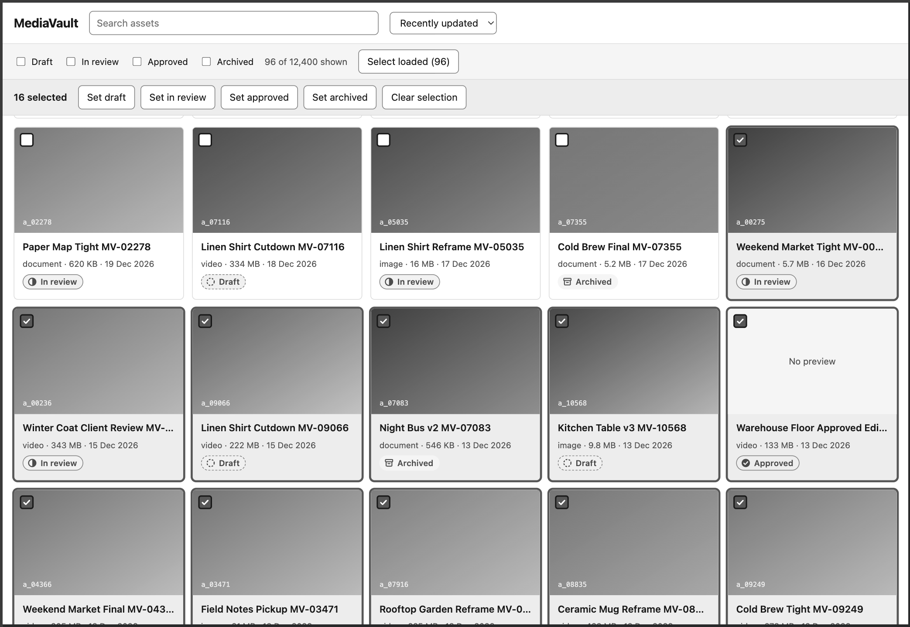
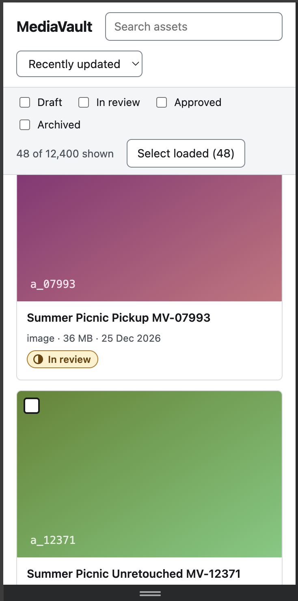

# MediaVault: Submission

## Video walkthrough

**Link:** **🟨 ADD:** paste the video link here once it is recorded.

---

## How to run it

- `npm install && npm run dev` is enough. API on 8787, app on 5173.
- `npm run check:contrast` re-checks every colour pair in `styles.css` against WCAG (22 pairs, all pass).
- I developed with `CHAOS=0 LATENCY=0` at times, but every check below was done with both on (the defaults).
- Node 22.19 on macOS.

## Time spent

- Total: about ~13 hours over 7 days.
- Reading the brief and the baseline, and the defect inventory: 2 h
- Search correctness, URL state and caching (Task 1): 1 h
- Grid virtualization and infinite scroll (Task 2): 1.5 h
- Bulk and optimistic updates, 409 handling (Task 3): 2 h
- Resilience, retry and offline (Task 4): 2.5 h
- Keyboard and screen reader support (Task 5): 1.5 h
- Interface and contrast (Task 6): 1 h
- Measurements and this write-up: 1.5 h

---

## Baseline defects found

Marked *(reproduced)* if I saw it happen, *(code)* if I found it by reading the code.

| # | Defect | Where | Fixed / left / out of scope |
| --- | --- | --- | --- |
| 1 | Bulk update sends every selected id in one call, refused above 50 *(code)* | `App.tsx` | Fixed: chunks of 50, two in flight (`bulk.ts`) |
| 2 | Search race: no cancellation or staleness guard, a slow old response overwrites a newer one *(reproduced with `tra` then `trail runner`)* | `useAssets.ts` | Fixed: per-query cache entries plus abort signal |
| 3 | No debounce: one request per keystroke, 6 for `runner` *(reproduced, Network tab)* | `App.tsx` | Fixed: 300 ms debounce with a local draft |
| 4 | Only the first 24 of 12,400 assets reachable, `nextCursor` unused *(reproduced)* | `useAssets.ts`, `App.tsx` | Fixed: cursor pagination, infinite scroll |
| 5 | Loading, failed and empty all render as "Nothing matches these filters" *(code)* | `App.tsx`, `AssetGrid.tsx` | Fixed: four distinct states |
| 6 | View state not in the URL, so reload and sharing lose it; filter order changes the query and can trigger `stale_cursor` *(code)* | `App.tsx`, `client.ts` | Fixed: URL state, canonical params |
| 7 | List not told about a saved edit (`handleSaved` empty), so rows go stale *(code)* | `App.tsx` | Fixed: cache patch |
| 8 | Bulk: no optimistic update, no per-id failure report, clears the whole selection even when some failed *(code)* | `App.tsx` | Fixed: optimistic, exact rollback, failed ids stay selected |
| 9 | Every card re-renders on any selection change *(code)* | `AssetGrid.tsx` | Fixed: memoised card, 1 re-render measured |
| 10 | No virtualisation, DOM grows with every loaded row *(code, measured)* | `AssetGrid.tsx` | Fixed: windowed grid |
| 11 | Grid not operable by keyboard: clickable divs, unnamed checkboxes and inputs *(reproduced)* | `AssetGrid.tsx`, `App.tsx` | Fixed: ARIA grid, roving tabindex, labels |
| 12 | Thumbnails ignore `hasThumbnail`, are not lazy, and a 404 shows a broken image *(code)* | `AssetGrid.tsx`, `AssetDetail.tsx` | Fixed: placeholder, `loading="lazy"`, `onError` fallback |
| 13 | Detail panel races when `id` changes quickly, no focus management, no Escape *(code)* | `AssetDetail.tsx` | Fixed |
| 14 | No 409 handling, no retry, no error boundary, no offline handling, raw `503: ...` strings shown to users *(code)* | `client.ts`, `AssetDetail.tsx` | Fixed |
| 15 | Status shown by tint only, and control borders at 1.37:1 against the 3:1 needed (WCAG 1.4.11) *(measured)* | `styles.css` | Fixed |
| 16 | `asset.width && ...` and `asset.durationSec && ...` can render a stray `0` *(code)* | `AssetDetail.tsx` | Fixed: `!= null` checks |
| 17 | `npm audit` reports 2 vulnerabilities in dev dependencies | `package.json` | Left: out of scope, and `audit fix --force` risks breaking the baseline |

---

## Key decisions

**Data fetching and caching**
- TanStack Query (`useInfiniteQuery`), keyed by a canonical query string without the cursor. Rejected: hand-rolling cancellation, in-flight dedupe and per-key caching, which is exactly what the library does and would have cost hours I spent elsewhere. Cost: about 19 kB gzipped and one more thing to explain.
- `staleTime` 30 s. `refetchOnWindowFocus` and `refetchOnReconnect` are off, because refetching an infinite list replays every loaded page against an 80 requests per 10 s budget.
- Pages are merged and de-duplicated by id, because the server cursor is an offset and rows shift when data changes.

**Stale response handling**
- Two layers. Each response lands in the cache entry for the query that produced it, and the screen only reads the current entry, so a late reply for an old query cannot appear. The abort signal also cancels the request.
- The cursor lives inside the cache entry, never in the URL or in loose state, so a cursor cannot outlive its query. Params are canonicalised (sorted lists, `sort` always sent) because the server's cursor fingerprint compares raw strings.
- Rejected: a "latest request id" ref. It hides stale results but keeps the cursor coupled to shared state.
- Debounce (300 ms) is separate: it saves rate-limit budget, cancellation does not (the server still counted the request).

**Virtualization approach**
- Hand-rolled row windowing. Card height is computed from column width, cards are absolutely positioned, and state holds only the first visible row, so it re-renders once per row crossed. Overscan 3 rows, prefetch when 3 rows from the end.
- The row holding keyboard focus is always mounted, otherwise scrolling would delete the focused element.
- Rejected: a library. I wanted every line explainable. Cost: fixed card height (long names truncate, full name in `title`), and scroll position is not restored on Back.

**Optimistic updates and rollback**
- Cards flip immediately by patching the list cache, and the originals are kept. Successes are replaced with the server's copy, failures are rolled back exactly, and a version guard means an older copy never overwrites a newer one. No refetch, which would replay every page.
- Bulk sends chunks of 50 with 2 in flight. Two retry layers: a failed request is resent whole, and per-id `conflict` results are resent alone. `legal_hold` and `not_found` are never retried. Failed cards stay selected, with a reason summary and a retry for the temporary ones only.
- Single-edit 409 policy: refetch, then compare. Already the wanted status (someone else, or our own reply was lost): treat as success. Status unchanged and only other fields moved: reapply once. Someone set a different status: do not overwrite, show the current state and offer "Set to X anyway". Rejected: blind retry (silently overwrites a colleague's decision) and always discard (makes the user redo work for nothing).

**Retry and backoff policy**
- One helper, `withRetry`. Whether to retry comes from `ApiError.retryable`, derived from status and code, never message text: network error, 429, 503 and the documented `write_failed` 500. Never 400, 409 or 422.
- Up to 4 attempts, exponential from 500 ms capped at 8 s, plus up to 250 ms jitter, and `Retry-After` wins when present. Offline stops retrying at once.
- A `write_failed` retry is safe because the server fails before it mutates (from reading `server/index.mjs`, not tested in isolation).
- Not built: queueing writes made while offline.
- Checked by hand: DevTools Offline (reads pause, a write fails fast without flipping the UI, bulk reports "lost connection" with a retry) and DevTools request blocking on `*/api/assets?*`, which produced exactly 4 attempts and then the error panel. I did not measure the gaps between attempts, so the delays above describe the policy in the code.

**State placement and URL sync**
- View state (`q`, status, kind, tag, collection, owner, sort) lives in the URL, hand-rolled on `useSyncExternalStore`. Push history for filters and sort, replace for typing. Parsing never throws, so a hand-edited URL falls back to defaults. The cursor is never in the URL.
- Selection, the open asset and bulk progress are component state, and selection is cleared when the view changes so the bulk bar cannot act on rows the user cannot see.
- Server data lives only in the query cache.
- Rejected: a router or a URL-state library, for about 60 lines I can defend.

---

## Performance

**Machine and browser:** Apple M2 Mac (arm64), Chrome 153.0.8010.48 (Official Build). Profiler numbers are from the dev build, so compare counts, not milliseconds. Everything else in the "after" column is the production build via `vite preview`.

| Metric | Before | After | How measured |
| --- | --- | --- | --- |
| Rendered DOM nodes at 5,000 rows loaded | about 36,200 at 5,232 rows (extrapolated from 24 rows: 200 nodes, 34 for an empty page) | 516 at 5,232 rows (48 cards mounted) | `document.getElementsByTagName('*').length`, after via console scroll loop |
| Cards re-rendered when toggling one selection | whole grid, all 24 rows (inline `map`, no memo) | 1 | React DevTools Profiler, dev build, default page size |
| Longest task during sustained scroll | not measurable, only 24 rows load | none over 50 ms (max 0) across the load loop and manual scroll, 5,232 rows loaded | `PerformanceObserver` on `longtask` (support confirmed in this browser) |
| Requests while typing `runner` | 6 | 1 typing continuously, 4 with pauses (3 cancelled) | Chrome DevTools Network, Fetch/XHR |
| Production bundle, gzipped | 48.30 kB JS, 1.17 kB CSS | 67.23 kB JS, 2.54 kB CSS | `vite build` output |

Caveats: the "before" DOM figure is an extrapolation because the baseline cannot load 5,000 rows. The re-render count was measured at the default page size, not at 5,000 rows.

**What was the actual bottleneck, and how did I find it?**
DOM size and render work both scaled with loaded rows. Counting nodes gave 200 for 24 cards and 34 for an empty page, so about 6.9 nodes per card, and the Profiler showed the grid re-rendering every row on any change. After windowing and memoising, the same page holds 516 nodes and one selection re-renders one card. The other bottleneck was the network: slow, unordered, rate-limited responses. I found it by watching the Network tab while typing, which showed six requests and a stale response reaching the screen in the baseline.

---

## Accessibility

**Keyboard model.** The grid is an ARIA `grid` with a single roving tab stop, so Tab enters and leaves it in one press. Arrow keys move between cards, Home and End go to the row ends (with Ctrl or Cmd, to the first and last card), Page Up and Down move by a screenful, Enter opens the detail panel, Space toggles selection, and Shift plus arrows extends a range. Opening the panel moves focus into it, and Escape or Close returns focus to the card that was open, or to the grid or search box if that card is gone. If a focused element is removed (a notice dismissed, the bulk bar closing), focus moves to the grid instead of the page body.

**How I tested it.**
- Keyboard only walkthrough: done by hand, through the commands in the keyboard model above, and they worked.
- Screen reader: I ran VoiceOver on macOS and it worked well while moving through the grid, selecting cards and searching. 
- Automated audit: Lighthouse Accessibility scored 100. That was for desktop mode. An automated audit catches only part of the problems, so I treat it as a check and not as proof.

**Known gaps.**
- No type-ahead and no Ctrl+A.
- Selection count changes are not announced. Selection state is exposed per cell instead.
- The row holding focus is out of DOM order when it is far from the viewport.
- `aria-rowcount` is approximate while pages are unloaded.
- The detail panel re-renders on every selection change (cheap, not memoised).

---

## Interface decisions

I optimised for scanning hundreds of cards quickly and for never leaving the user unsure what happened after an action. That led to restraint: one accent colour, a small token set, and status that reads as a progression through icon, border style and label so it survives greyscale. Every state (loading, empty, error, offline, partial failure) says what happened and what to do next.

- **Visual system.** Tokens live in the `:root` block of `src/styles.css`: surfaces and ink, one accent, feedback colours, four status colour pairs, a 12 to 18 px type scale, a 4 px spacing base and one radius. The card body height is tied to `BODY_H` in `gridLayout.ts`.
- **Status treatment.** Draft is a dashed circle with a dashed border, in review a half-filled circle, approved a filled circle with a check, archived an archive box with no border. The detail panel shows the same four in order as a segmented control. Checked with Chrome DevTools achromatopsia emulation, where the four statuses stayed distinguishable (screenshot below).
- **States.** Loading: skeleton with "Taking longer than usual. Retrying..." while backing off. Empty: names the query and offers to clear it. Error: reason, small reference id, retry button. Offline: banner, reads paused, writes fail fast without flipping the UI. Partial failure: counts by reason, failed cards stay selected, retry only for temporary failures.
- **Contrast.** Checked with `npm run check:contrast`, which reads the tokens from the CSS. Text pairs range from 6.39:1 (error text on its banner) to 17.77:1, and control and border pairs from 3.61:1 to 3.94:1 against the 3:1 needed. The baseline's text passed (5.26 to 5.69:1) but its control borders were 1.37:1.
- **Copy.** Rewrote raw `503: ...` strings and leaked limits into messages such as "You're offline. Reconnect and try again.", "The library is busy right now. Try again in a moment.", "This asset is on legal hold, so it cannot be archived.", the 409 message that names the current status, and the bulk summary "N could not be changed (41 on legal hold, 7 hit a temporary error). They stay selected."

Narrow window: checked at 360 px in DevTools responsive mode.

---

## Trade-offs and cuts

- No UI for kind, tag, owner or collection filters. The URL model and the API client support them, but only status and sort have controls.
- No offline write queue, no live updates from `/api/events`, no `/api/stats` header, no tests.
- Offset pagination can still skip rows when data changes mid-scroll. De-duplication only fixes duplicates.
- Bulk work cannot be cancelled once started.
- Selection does not span searches, and scroll position is not restored on Back.
- Fixed card height means long names are truncated.
- Error boundaries exist at three levels: the app, the asset list and the detail panel. I did not force a render error to exercise them, and I did not add per-card boundaries because the dataset is fixed and known-good, so a render error in one card would fall back to the whole list (with Try again, and it resets when the view changes). Per-card boundaries would be the next step if the data could not be trusted.

With another day: reconcile the SSE stream with the cache (the version-guarded cache patch is already the right primitive), a handful of tests on `runPool`, `processChunk` and the 409 resolution, and a real fix for skipped rows.

## Critique of the API

Read from `server/index.mjs` and `data.mjs`, not all tested:
- The cursor is an offset plus a fingerprint, so pages shift under concurrent writes, and the fingerprint is string-sensitive (`status=a,b` versus `b,a`, or omitting `sort`). The client had to canonicalise every query.
- A 409 returns no current version or asset, so resolving a conflict costs an extra GET and a second rate-limit token.
- There are no idempotency keys, so a lost PATCH reply looks like a conflict on retry, and the client has to infer that it already landed.
- The rate limit counts rejected and cancelled requests, and is keyed on socket IP, so behind a proxy all users share one budget.
- Bulk takes no `version`, so it cannot detect conflicts, and its legal-hold rule (any status change fails) is stricter than PATCH (only archiving fails).
- The random 500 on PATCH happens before validation, so it can hide a 422 until the retry.
- A negative `limit` produces an empty page with a non-null `nextCursor` (read from the code, untested).
- JSON responses are `no-store`, and the event stream has no ids, so it cannot resume.

## Anything you would like us to look at

I would like feedback on the 409 policy in `saveStatus` (`statusEdit.ts`): refetch, treat it as success if the status already matches, reapply once if only other fields changed, otherwise show the conflict and offer "Set to X anyway". I am unsure whether "anyway" is the right default for a status change, or whether the user should have to confirm it more explicitly.